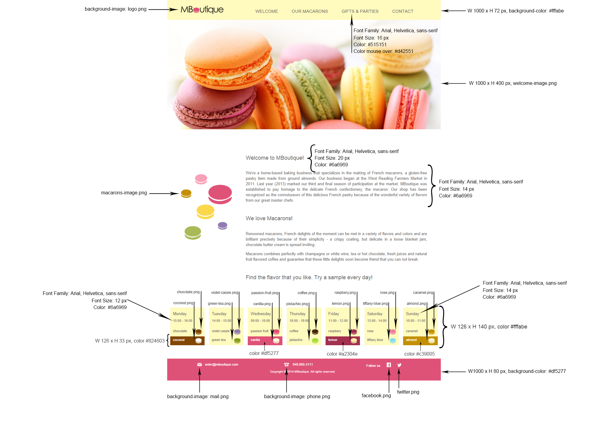

# MBoutique

**About the Project**

The purpose of this project was to learn about web page structure and layout. The Photoshop documents (seen below) were convereted into HTML, Styled with CSS and then linked together using standerd href attributes.  After completing the assignment I decided to make the entire site mobil responisve using the Bootstrap library and a little flexbox.  In addition, I implemented Angular Route and Angular Translate.  This allows the user to switch between views without needing to load an entire page every time.  With Angular translate I was able to learn about converting a website to a different language, in this case Spanish.

**Features Implemented**

* Mobile Responsive Design (Bootstrap, Flexbox)
* Angular Routing (UI-Rout)
* Angular-Translate (Spanish)

